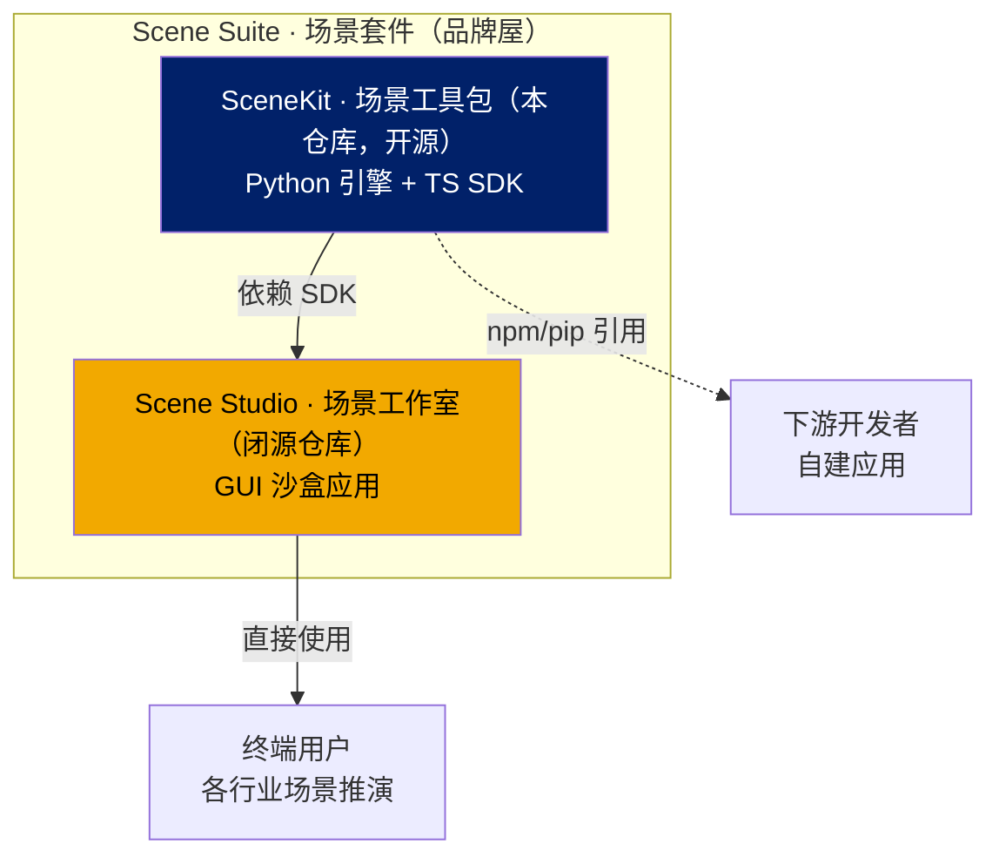

# SceneKit · 场景工具包

> **Scene Suite 伞形品牌下的开源 SDK**（Python 引擎 + TypeScript 前端）
>
> ⚠️ 本项目与 Apple 的 SceneKit 框架**无任何关联**，仅为命名巧合。

基于 RECS（SoA ECS 引擎）的场景建模 SDK：

- **Python 引擎** — `scene_kit`：Entity 场景建模、列式快照协议、行为与调度系统
- **TypeScript SDK** — `@scene-kit/*`：core / vue / renderer-2d / main-ui-adapter

> **Scene Studio（场景工作室）** 是基于本 SDK 构建的**闭源** GUI 应用，不在此仓库中。



## v0.6.0

- 交互协议：`WorldSnapshot`/`WorldDelta`、msgpack、WebSocket 重连、心跳与可选鉴权钩子。
- 运行时：`ModelSession` 支持运行、暂停、单步、重置及实体增删改移动。
- 前端：core/vue/renderer-2d/main-ui-adapter 四包可独立以 `file:` 依赖被 Studio 消费。
- 真实接入示例见 `docs/API_手册.md` 与 `docs/下游消费者集成指南.md`。

## v0.5.1

- **品牌终局**：伞形品牌调整为 **Scene Suite**（场景套件），应用仓库 `scene-sandbox` → **`scene-studio`**（场景工作室，闭源）。对齐 autodo 系列命名：suite 伞形 + kit SDK + studio/app 应用。
- **仓库拆分**：SDK（本仓库，开源）与应用（`scene-studio`，闭源）为两个同级仓库。伞形品牌 **Scene Suite** 不再对应独立仓库，仅作为品牌屋/聚合工作区存在于各仓库文档。

## v0.5.0

- **仓库拆分**：SDK（本仓库，开源）与应用（原 `scene-sandbox`，闭源）拆分为两个同级仓库。
- 仓库与包名统一为 `scene-kit`：Python 导入路径为 `scene_kit`，npm 包名为 `@scene-kit/*`。
- **命名演变**：`world-model-kit`（2026-07-15 起）→ `sceneforge`（2026-08-10）→ `scene-studio`（2026-08-11，伞形）→ `scene-kit`（SDK，2026-08-12）→ `scene-suite` 伞形 + `scene-studio` 应用（2026-08-12，终局）。
- `WorldSnapshot` / `WorldDelta` 是正式前后端协议：按 `EntityKind` 分批、按字段列式导出（SoA），实体以 `(kind, uid)` 稳定标识。
- `ModelSession` 和可选的 WebSocket 服务提供播放、暂停、单步、重置与受控状态修改。
- `frontend/` 是 PNPM workspace，提供 `@scene-kit/core`、`@scene-kit/vue`、`@scene-kit/renderer-2d`、可选 `main-ui` 适配器。

## 安装

```bash
uv sync
uv sync --extra dev
uv sync --extra server
```

RECS 通过 `pyproject.toml` 中的本地源映射到相邻的 `../relation-entity-component-system` 仓库。

## 第一个场景

```python
import numpy as np
from scene_kit import EntityKind, WorldModel

model = WorldModel(seed=42)
model.add_root_surface(200, 200)
model.register_kind(EntityKind("bird", geometry="point", tags={"vx": np.float32}))
model.spawn("bird", n=2, u=[10, 20], v=[15, 25], vx=[1.0, -1.0], r=60, g=180, b=220)

snapshot = model.export_snapshot(format="dict")
batch = snapshot["entityBatches"]["bird"]
print(batch["columns"]["uid"])
print(batch["columns"]["u"])
```

## 运行 Demo

```bash
uv run --extra server python -m demos.demo_flocking --serve
```

> 前端 Studio 应用（含 `pnpm dev`）位于闭源仓库 `../scene-studio`。

## 仓库结构

```text
scene_kit/               Python 场景建模引擎、协议、会话和传输
frontend/packages/       @scene-kit/core, vue, renderer-2d, main-ui-adapter
demos/                   示例场景模型（flocking, traffic, predator-prey…）
docs/                    用户、API、开发与集成文档
```

更多内容见 [用户手册](docs/用户手册.md)、[API 手册](docs/API_手册.md)、[开发者指南](docs/开发者指南.md) 和 [下游消费者集成指南](docs/下游消费者集成指南.md)。
